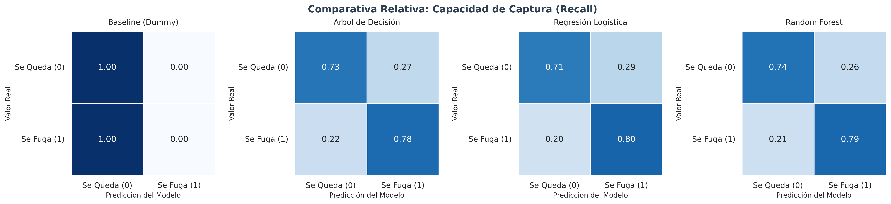
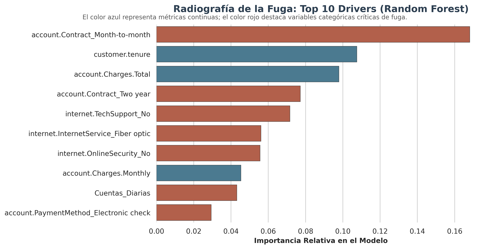
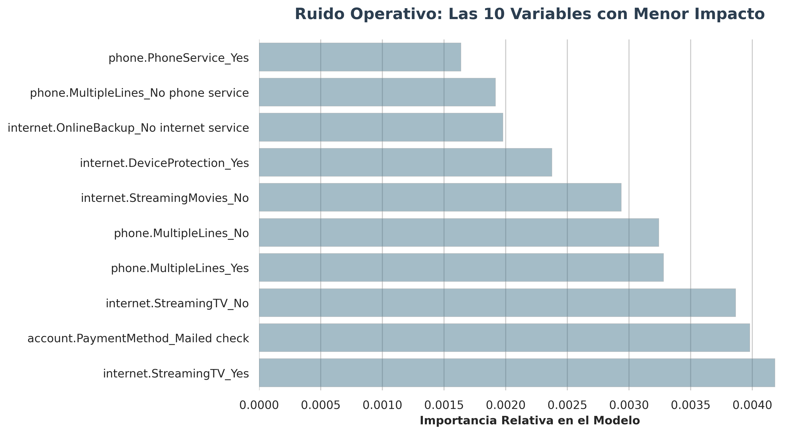

# 📊 Telecom X – Predicción Estratégica de Evasión de Clientes (Churn)

[](https://colab.research.google.com/github/eppursimuove9/telecom-x-churn-prediction/blob/main/telecom_x_churn_prediction.ipynb)

* LinkedIn: [Alex Rojas Segovia](https://www.linkedin.com/in/alexrojassegovia/)
* Email: [Email](mailto:alexrojas8922@gmail.com)

---

## 🧠 Introducción
Este proyecto representa la fase avanzada de análisis predictivo para **Telecom X**. El objetivo central es transformar datos históricos de comportamiento de clientes en un motor de decisión capaz de anticipar la deserción (*churn*). 

A diferencia de enfoques puramente estadísticos, este trabajo implementa una arquitectura de **Machine Learning de nivel industrial**, utilizando Pipelines automatizados para garantizar la escalabilidad y robustez del modelo en un entorno de producción.

## 🎯 Objetivos del Proyecto
* **Ingeniería de Características:** Implementar transformadores automáticos para datos categóricos y numéricos.
* **Modelado de Ensamble:** Superar la inercia del negocio mediante el uso de algoritmos de bosque aleatorio (*Random Forest*).
* **Optimización del Recall:** Maximizar la detección de clientes en riesgo para reducir el costo de oportunidad.
* **Inteligencia de Negocio:** Traducir métricas técnicas (F1-Score, Gini) en *insights* accionables para el equipo de Marketing.

## 🧹 Arquitectura de Datos y Preprocesamiento
Se diseñó un `ColumnTransformer` integrado en un `Pipeline` de Scikit-Learn que ejecuta:
* **Variables Categóricas:** Codificación mediante `OneHotEncoder` con manejo de categorías desconocidas.
* **Variables Numéricas:** Estandarización estadística para modelos sensibles a la escala.
* **Gobernanza:** Separación estricta de datos de entrenamiento y prueba (*Hold-out method*) para prevenir el *Data Leakage*.

## 🤖 Modelado y Evaluación Comparativa
Se contrastaron tres enfoques para identificar la mejor solución:
1.  **Baseline (Dummy Classifier):** Punto de control para medir la inercia del mercado.
2.  **Árbol de Decisión:** Primer modelo predictivo no lineal, utilizado para establecer una base de interpretabilidad lógica.
3.  **Regresión Logística:** Modelo lineal para establecer una base de interpretabilidad.
4.  **Random Forest (Modelo Campeón):** Seleccionado por su capacidad para capturar interacciones no lineales y su robustez frente al sobreajuste.

### Desempeño del Modelo Campeón:
| Métrica | Resultado (Clase 1) | Impacto de Negocio |
| :--- | :--- | :--- |
| **Recall** | **79%** | Alta capacidad de captura de desertores. |
| **Precision** | **53%** | Optimización de recursos en campañas de retención. |
| **F1-Score** | **0.63** | Equilibrio óptimo para la toma de decisiones. |

## 📈 Visualización de Resultados Críticos

Aquí se presentan los pilares visuales que sustentan la estrategia:

### 1. Matriz de Confusión (Capacidad de Captura)
  
*Insight: El modelo logra reducir drásticamente los falsos negativos, identificando proactivamente a la mayoría de los clientes en riesgo.*

### 2. Drivers de Fuga (Top 10 Importancia)
  
*Insight: Los contratos mensuales y la baja antigüedad son los disparadores críticos de abandono.*

### 3. El "Ruido" del Modelo (Bottom 10 Variables)
  
*Insight: Identificación de factores irrelevantes para optimizar el enfoque operativo del equipo de retención.*

## 📌 Conclusiones Ejecutivas
El modelo **Random Forest** se consolida como la herramienta de mayor valor para Telecom X. La capacidad de detectar al **79%** de los clientes fugitivos permite pasar de una gestión reactiva a una estrategia proactiva de "alerta temprana". El análisis confirma que la lealtad se construye en los primeros 6 meses; superar esa barrera de madurez es clave para la salud financiera de la cuenta.

## 💡 Recomendaciones Estratégicas
1.  **Migración de Contratos:** Incentivar el paso de contratos mensuales a anuales mediante beneficios de lealtad.
2.  **Onboarding Crítico:** Reforzar la atención al cliente durante el primer trimestre de antigüedad.
3.  **Despliegue Técnico:** Integrar el archivo `modelo_rf_churn_campeon.pkl` en el CRM de la compañía para automatizar las alertas.

📂 4. Estructura del Repositorio
El proyecto sigue una arquitectura de archivos organizada para garantizar la reproducibilidad y el orden de los activos de Aineurolytics:

Plaintext
```telecom-x-churn-prediction/
│
├── assets/                 # Visualizaciones en alta resolución (Confusion Matrix, Feature Importance)
├── data/                   # (Local) Directorio para el dataset tratado (.csv)
├── .gitignore              # Configuración de archivos excluidos del control de versiones
├── README.md               # Documentación ejecutiva y técnica del proyecto
├── telecom_x_churn.ipynb   # Notebook principal: Preprocesamiento, Modelado y Evaluación
└── requirements.txt        # Listado de dependencias para la reconstrucción del entorno
```

⚙️ 5. Reproducibilidad
Para clonar, instalar y ejecutar este proyecto en tu entorno local (Mac/Linux/Windows), sigue estos pasos:

Clonar el repositorio:

```Bash
git clone https://github.com/eppursimuove9/telecom-x-churn-prediction.git
cd telecom-x-churn-prediction
```

Crear un entorno virtual (opcional pero recomendado):

```Bash
python3 -m venv venv
source venv/bin/activate
```

Instalar dependencias:

```Bash
pip install -r requirements.txt
```

## 🛠️ Tecnologías Utilizadas
* **Core:** Python 3.12, Pandas, NumPy.
* **ML:** Scikit-learn (Pipelines, Ensemble Methods).
* **Viz:** Matplotlib, Seaborn.
* **Deployment:** Joblib.

---


